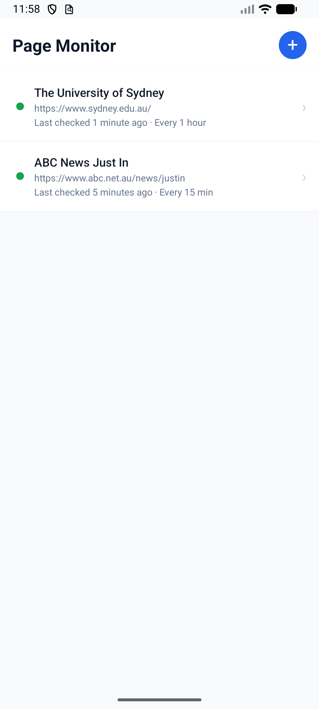
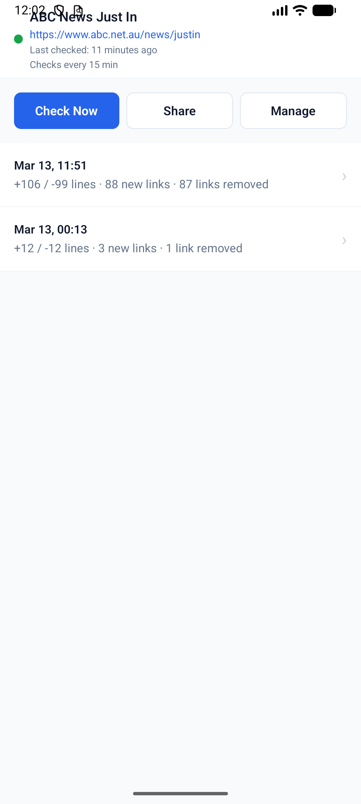
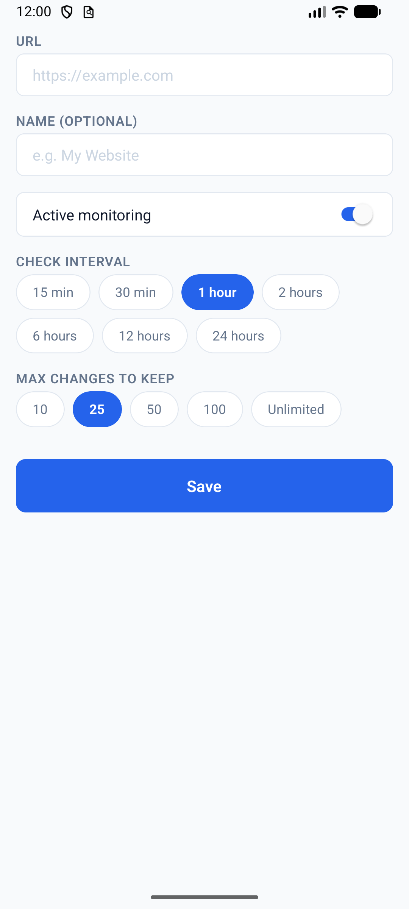
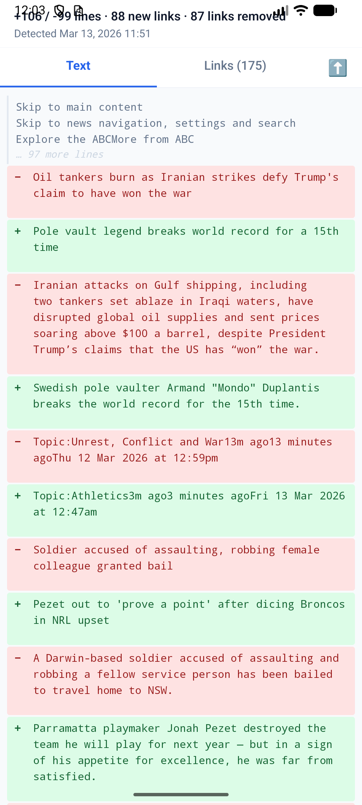

# Page Monitor

A React Native Android app that monitors web pages for changes and notifies you when something changes.

## Background

This is my first mobile app — built entirely through AI-assisted development (vibe coding with Claude Code). My background is in data science and scientific computing (Python, SQL, R, MATLAB, and Fortran), with no prior experience in mobile development. This project served as both an experiment in AI-assisted development and a practical solution to a small problem in my daily life.

## Features

- **Page Monitoring** — Track any web page for text and link changes
- **Configurable Intervals** — Background monitoring from every 15 minutes to every 24 hours
- **Visual Diffs** — See exactly what changed with color-coded comparisons
- **Push Notifications** — Get notified immediately when a change is detected
- **Multiple Pages** — Monitor as many pages as you need
- **Share Changes** — Share detected changes with the page link and diff summary
- **Bilingual** — English and Traditional Chinese (繁體中文)

## Screenshots

| Home | Page Detail | Add / Edit | Diff View |
|------|-------------|------------|-----------|
|  |  |  |  |

## Prerequisites

- [Node.js](https://nodejs.org/) v18 or later
- [Android Studio](https://developer.android.com/studio) with:
  - Android SDK (API 34+)
  - Android SDK Build-Tools
  - Android SDK Platform-Tools
- JDK 17 (bundled with Android Studio)
- Environment variables set:
  - `ANDROID_HOME` pointing to your Android SDK
  - `JAVA_HOME` pointing to your JDK installation

## Installation

```bash
# Clone the repository
git clone https://github.com/phykawing/PageMonitor.git
cd PageMonitor

# Install dependencies
npm install

# Start the Metro bundler
npx react-native start

# In another terminal, build and run on Android
npx react-native run-android
```

## How It Works

1. **Add a page** — Enter a URL you want to monitor
2. **Initial snapshot** — The app fetches the page and saves its content
3. **Background checks** — At the configured interval, the app re-fetches each page in the background
4. **Change detection** — New content is compared against the last snapshot using FNV-1a hashing (fast path) and text diffing (detailed comparison)
5. **Notification** — If changes are found, you get a push notification
6. **View diffs** — Tap to see what changed: added/removed text and links

## Tech Stack

| Library | Purpose |
|---------|---------|
| [React Native](https://reactnative.dev/) | Cross-platform mobile framework |
| [React Navigation v7](https://reactnavigation.org/) | Screen navigation |
| [WatermelonDB](https://github.com/Nozbe/WatermelonDB) | Local database (SQLite-backed) |
| [react-native-mmkv](https://github.com/mrousavy/react-native-mmkv) | Fast key-value storage for settings |
| [react-native-background-fetch](https://github.com/transistorsoft/react-native-background-fetch) | Background task scheduling |
| [@notifee/react-native](https://notifee.app/) | Local push notifications |
| [htmlparser2](https://github.com/fb55/htmlparser2) | HTML parsing and text extraction |
| [diff (jsdiff)](https://github.com/kpdecker/jsdiff) | Text diff computation |
| [i18next](https://www.i18next.com/) | Internationalization |
| [zustand](https://github.com/pmndrs/zustand) | State management |
| [date-fns](https://date-fns.org/) | Date formatting |
| [@react-native-vector-icons/ionicons](https://github.com/oblador/react-native-vector-icons) | Icons |

## Project Structure

```
src/
├── app/              # Root component and navigation setup
├── screens/          # App screens (Home, AddEdit, PageDetail, DiffView)
├── components/       # Reusable UI components
├── database/         # WatermelonDB schema, models, and init
├── services/         # Core logic (fetching, parsing, diffing, notifications)
├── store/            # Zustand and MMKV state management
├── hooks/            # Custom React hooks
├── i18n/             # Translations (English, Traditional Chinese)
├── utils/            # Utility functions
└── theme/            # Colors, typography, spacing constants
```

## Building a Release APK

### Generate a signing keystore (one-time)

```bash
keytool -genkeypair -v -storetype PKCS12 -keystore page-monitor.keystore -alias page-monitor -keyalg RSA -keysize 2048 -validity 10000
```

### Configure signing

Add to `android/gradle.properties`:
```properties
MYAPP_UPLOAD_STORE_FILE=page-monitor.keystore
MYAPP_UPLOAD_KEY_ALIAS=page-monitor
MYAPP_UPLOAD_STORE_PASSWORD=your_password
MYAPP_UPLOAD_KEY_PASSWORD=your_password
```

### Build the APK

```bash
cd android
./gradlew assembleRelease
```

The APK will be at `android/app/build/outputs/apk/release/app-release.apk`.

## Installing the APK

1. Transfer the APK to your Android device
2. On your device, go to **Settings > Security** and enable **Install from unknown sources** (or grant permission when prompted)
3. Open the APK file to install

## Known Limitations

- **JavaScript-rendered content**: Pages that load content dynamically via JavaScript (SPAs) may not show their dynamic content, since the app uses a simple HTTP fetch rather than a full browser engine.
- **Battery optimization**: Some Android manufacturers (Xiaomi, Huawei, Samsung) aggressively restrict background tasks. You may need to disable battery optimization for the app in your device settings.
- **Check timing**: Android's minimum background fetch interval is 15 minutes, and Doze mode may batch or delay tasks. Checks are approximate and not guaranteed to be exact.

## Contributing

1. Fork the repository
2. Create a feature branch (`git checkout -b feature/my-feature`)
3. Commit your changes (`git commit -m 'Add my feature'`)
4. Push to the branch (`git push origin feature/my-feature`)
5. Open a Pull Request

## License

This project is licensed under the MIT License. See [LICENSE](LICENSE) for details.
